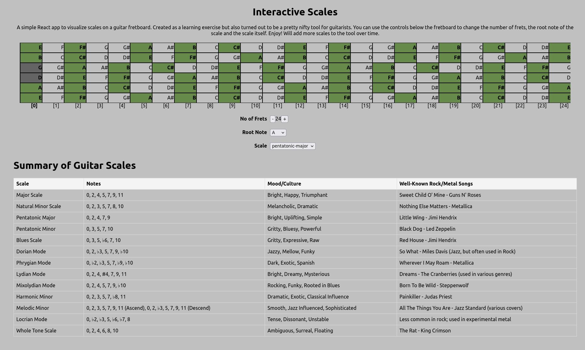

# A sample React App that visualises Guitar Scales

A simple app implemented in React to visualise the notes of various scales on an interactive guitar fretboard. The purpose of this project was for me to learn a bit more about how React works as I am primarily a Back-end developer.

